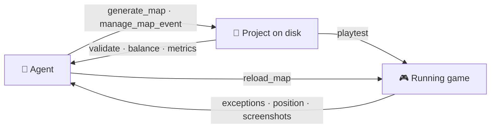
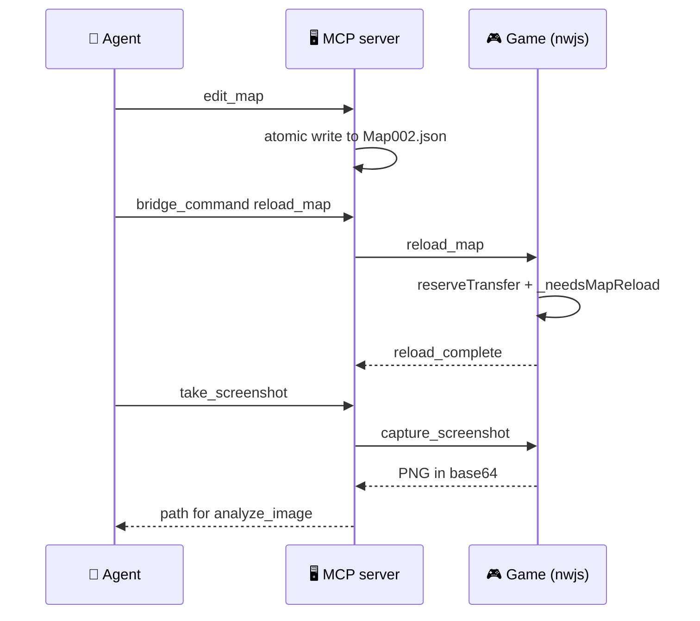

<div align="center">

# 🎮 RPG Maker MV Ultimate

### An AI copilot that builds, understands and *watches* your RPG Maker MV game

[](https://www.npmjs.com/package/rpgmaker-mv-mcp)
[](https://www.npmjs.com/package/rpgmaker-mv-mcp)
[](https://github.com/DiegoLopez0208/RpgMakerMVUltimate-MCP/actions/workflows/ci.yml)
[](https://registry.modelcontextprotocol.io)
[](https://nodejs.org)
[](LICENSE)

**[Quick start](#-quick-start) · [What it does](#-what-it-does) · [Map generation](#️-map-generation) · [Live bridge](#-the-live-bridge) · [Intelligence](#-project-intelligence) · [Tools](#-the-13-tools)**

</div>

---

A [Model Context Protocol](https://modelcontextprotocol.io/) server that lets an AI agent work on a **real RPG Maker MV project on disk** — database, maps, events, plugins, system — through **13 consolidated tools** validated against the actual engine, so what comes out is coherent and playable.

It does three things that are usually missing:

|  | |
|---|---|
| 🏗️ **Builds** | Generates maps that look hand-made, wires events from presets, and edits every database with real IDs instead of invented ones. |
| 🧠 **Understands** | Reads the whole project and answers *why the door never opens*, *which map nobody can reach*, *which skill breaks the game*. |
| 👀 **Watches** | Runs the game and reports back: exceptions, player position, screenshots — and reloads a map you just edited without losing the save. |

<br>

## ⚡ Quick start

**1 — Add it to your MCP client.** No clone needed; the package ships an executable.

```json
{
  "mcpServers": {
    "rpgmaker-mv": {
      "command": "npx",
      "args": ["-y", "rpgmaker-mv-mcp"],
      "env": {
        "RPGMAKER_PROJECT_PATH": "C:/path/to/your/RPGMakerMV/project"
      }
    }
  }
}
```

<details>
<summary>Claude Code one-liner, and running from source</summary>

<br>

```bash
# Claude Code, user scope
claude mcp add rpgmaker --scope user \
  --env RPGMAKER_PROJECT_PATH="C:/path/to/project" \
  -- npx -y rpgmaker-mv-mcp
```

```bash
# From source
git clone https://github.com/DiegoLopez0208/RpgMakerMVUltimate-MCP
cd RpgMakerMVUltimate-MCP
npm install && npm run build
RPGMAKER_PROJECT_PATH=/path/to/your/project npm start
```

MCP clients load tool definitions once at startup, so **restart the client** after adding or upgrading the server.

</details>

**2 — Point it at a project.** `RPGMAKER_PROJECT_PATH` is the folder containing `data/`, `js/` and `index.html`. The server starts without it; call `set_project_path` at runtime instead if you prefer.

**3 — Let the agent look around first.**

```
get_project_context { detail: "full" }        → what exists, with real IDs
analyze_project     { view: "overview" }      → health, counts, unreachable maps
```

Works with Claude Desktop, Claude Code, opencode, and any MCP-compatible client.

<br>

## 🧭 What it does



The bottom half of that loop is what the bridge adds. Before it, the agent wrote files and hoped.

<br>

## 🗺️ Map generation

Two paths, both behind `generate_map`. Pick by whether your project uses RTP art.

| | `mode: "procedural"` *(default)* | `mode: "semantic"` |
|---|---|---|
| **How** | Clones a hand-authored map from the **106 bundled RTP templates**, closest size first | Lays out a **mission graph**, then paints it through a tileset profile |
| **Looks like** | Real multi-tile buildings, walls, furniture | Rooms and corridors shaped by what the space is *for* |
| **Tilesets** | RTP, or close to it | **Any** — DLC, itch.io, custom |
| **Guarantees** | Same `seed` → same map | Same `seed` → same map, and the key is always reachable **before** the door it opens |

### The knowledge-driven path

```json
{ "mode": "procedural", "theme": "town", "name": "Riverbend", "width": 40, "height": 30 }
```

Themes with a matching template — **town, village, dungeon, interior, castle, world** and more — clone a real map instead of painting tile noise. Themes without one (**beach, swamp, desert…**) fall back to Perlin terrain, BSP dungeons and cellular caves. Combat themes auto-wire random encounters from your existing troops; town and village auto-create enterable house interiors with two-way warps.

> **Themes** · `forest` `town` `village` `castle` `dungeon` `cave` `beach` `desert` `swamp` `ruins` `interior` `snow` `harbor` `volcano` `sewer` `fortress` `magic_forest` `magic_interior` `space_interior` `space_exterior` `world`

Other modes: `blank` (empty canvas), `themed` (simple layout), `template` (one specific bundled map), `batch` (many at once), `duplicate` (copy an existing map).

### The tileset-independent path

The bundled templates are raw MV map JSON, so their tile IDs only mean anything on RTP sheets. Change the tileset and the map turns to noise. `semantic` keeps the layout abstract until the last moment:

```
manage_system { action: "mine_templates" }               # learn from THIS project
generate_map  { mode: "semantic", tilesetId: 5, rooms: 6, seed: 42 }
```

- **Mining** reads every map you already made and derives semantic layouts (ground / wall / water / prop / door, multi-tile props kept whole), a **tileset profile** naming the concrete tile your project uses for each role, and token adjacency counts. Nothing in the project is modified — everything lands in `.mcp-cache/`.
- **Generating** builds the mission first — entrance → key → locked door → treasure → boss → exit, plus side rooms — as a graph whose edges are the only ways through, *then* paints it. Because the lock is an edge and the key sits on the entrance side of it, the map is **solvable by construction**. Autotile shapes are recomputed at the end from the finished neighbourhood, never guessed cell by cell.
- The result includes `markers` naming the cell of every mission role, which is where to put events with `manage_map_event`.
- Pass a mined `templateId` (e.g. `"mined-3"`) to re-materialise one of your **own** maps onto a different tileset.

<br>

## 🔌 The live bridge

`playtest` on its own is fire-and-forget: the game opens and nothing comes back. The bridge closes the loop.

```
manage_system { action: "install_bridge_plugin" }   # once per project
manage_system { action: "bridge_start" }            # opens ws://127.0.0.1:32123
manage_system { action: "playtest" }                # the game connects on its own
manage_system { action: "bridge_telemetry", types: ["exception", "log"] }
```



- **📡 Telemetry** — exceptions with stack traces, `console.error`/`warn`, scene changes, player position, *which event command is executing* (so a hung event can be pinpointed), FPS and heap. Frames are consumed as you read them unless you pass `peek`.
- **♻️ Hot reload** — `reload_map` re-reads the current `MapXXX.json` and rebuilds the scene **without losing party state**: it reserves a transfer to the player's own position with `_needsMapReload`, the engine's own reload seam, rather than rebuilding `Spriteset_Map` by hand. `reload_database` re-reads one data file; `System.json` and `Tilesets.json` need a fresh playtest and are refused with an explanation.
- **📸 Screenshots** — `take_screenshot { name: "collision-proof" }` captures the live playtest through the MCP plugin, saves a timestamped PNG under `.mcp-cache/screenshots/`, and returns its path for inspection or QA evidence. No shell screenshot command is involved. `manage_system { action: "bridge_screenshot" }` remains as a compatibility alias.

> ### 🔒 Security
> The plugin **returns before anything else runs** unless the game is under NW.js *and* was launched with a `test` argument. A deployed build a player double-clicks never reaches the socket code, or even `require('fs')`.
>
> It checks every argument rather than only `argv[0]` the way `Utils.isOptionValid` does, because `playtest` passes the project path first. So a deployed build *deliberately* launched with a literal `test` argument would get past the guard — and then find no handshake file, and never connect.
>
> The server binds `127.0.0.1` only, refuses any upgrade carrying a browser `Origin` (cross-site WebSocket hijacking), and requires the session token from `.mcp-bridge.json` — compared in constant time — within 5 seconds or the connection is dropped.
>
> The command surface is a fixed allowlist with **no `eval` primitive**.

<br>

## 🔍 Project intelligence

`analyze_project` is read-only and fully offline. It models the whole project once, so an agent can reason about a game it did not build.

| View | Answers |
|---|---|
| `overview` | **Call this first.** Counts, health summary, maps unreachable from the start |
| `validate` | Every consistency problem at once — see below |
| `explain` | *Why does this never happen?* e.g. "Switch 12 is gated in 3 places but **never set ON**" |
| `usage` | Every event, common event and troop that touches a switch/variable/item, with read-write roles |
| `graph` | The map transfer network and what is reachable |
| `ast` | One event's logic as a readable tree |
| `plugins` | What plugins the project uses, their parameters and commands |
| `critique` | A designer's **opinion** on one map: dead space, clutter, event spread, monotony |
| `metrics` | The same map **measured** — see below |
| `balance` | Database entries that are out of line with their peers — see below |
| `refactor` | Command sequences copy-pasted across events, worth extracting into a Common Event |
| `search` | Find things by meaning across names, dialogue and descriptions |
| `index` | The structured digest the other views are built on |

<details>
<summary><b>validate</b> — the problems the editor never warns about</summary>

<br>

Broken transfers, missing map files, dangling common-event/item/troop references, duplicate IDs, named-but-unused switches and variables, a bad starting position, unreachable maps — and actor names written into dialogue as `\N[id]` that do not resolve.

That last one is worth its own sentence: the engine resolves `\N[id]` at draw time, not from any structural parameter, so a bad id passes every other check and the editor shows nothing wrong. The line just renders in-game with a hole where the name should be, and a player finds it before you do.

</details>

<details>
<summary><b>metrics</b> — measured, not judged</summary>

<br>

- **Reachability** — flood fill from the *real* entry point. Walkable tiles the player can never get to, and events with no reachable tile beside them, are softlocks rather than style notes.
- **Dead space** — the unreachable share of the rectangle, against a band for `expected` (`interior` / `dungeon` / `exterior`).
- **Shape** — the walkable area thinned to a one-cell skeleton and read as a graph: endpoints, junctions, cycles, critical path, linearity. Linearity near 1 is a corridor with no choice to make.
- **Variety** — Shannon entropy over 5×5 tile windows: the monotonous-floor problem, measured.
- **Tension** — for maps with random encounters, how many steps the player is from a shop, inn or save point.

</details>

<details>
<summary><b>balance</b> — outliers relative to their peers, not to invented thresholds</summary>

<br>

A skill dealing 400 damage is fine in a game where everything does, and broken in one where nothing else breaks 60. So each entry is scored on a power metric and compared against the *others* in its category: damage per MP for skills, gold per point of ATK+MAT for weapons, gold per DEF+MDF for armors, HP per EXP for enemies.

The comparison is **leave-one-out** — an entry is judged against statistics it had no hand in creating. Included in its own numbers, a badly broken entry drags the mean toward itself until it stops looking unusual at all.

Damage formulas are **parsed, never executed** (tokenise → shunting-yard → evaluate). One that cannot be read statically is listed under `unreadableFormulas` rather than scored as zero damage, which would pull every average down and hide the very outliers you were looking for.

Narrow with `category`, loosen or tighten with `thresholdSd` (default 2).

</details>

### Offline map inspection

- `query_map { view: "ascii", mapId }` — render a map as a character grid with event markers. The cheapest way to *see* a layout and pick coordinates.
- `query_map { view: "validate", mapId }` — lint one map for invalid tile IDs, broken transfers and missing event terminators.

<br>

## 🧰 The 14 tools

<details>
<summary>Click to expand the full surface</summary>

<br>

| Tool | Purpose |
|---|---|
| `query_database` | List / get by ID / search any database (actors, classes, skills, items, weapons, armors, enemies, states, troops, tilesets, common events, animations) |
| `create_database_entry` | Create entries, with presets: `damage_skill`, `healing_skill`, `buff_skill`, `state_skill`, `boss_enemy`, `encounter_troop` |
| `update_database_entry` | Partial updates (incl. troops & animations); append commands to common events; add enemies to troops |
| `delete_database_entry` | Delete entries with reference-breakage warnings |
| `query_map` | Map tree, full map data, events, single event, lint, offline ASCII render |
| `generate_map` | Knowledge-driven, semantic, procedural, blank, themed, template, batch or duplicate |
| `edit_map` | Fill tile layers, set display names, organize the map tree, connect two maps, set encounters |
| `manage_map_event` | Create (presets: npc, chest, teleport, door, shop, inn, boss, puzzle_switch), update, **convert** an NPC into a merchant/inn/sign in place, delete, add commands, bulk-populate |
| `manage_system` | Title, switch/variable names, starting position, **author a plugin**, **scaffold a project**, **playtest**, **open in editor**, **mine templates**, and the **live bridge** |
| `take_screenshot` | Capture and name a live playtest PNG through the authenticated MCP bridge |
| `analyze_project` | The read-only intelligence layer above |
| `get_project_context` | Project digest, asset index, per-tileset tile IDs, bundled-template catalog |
| `set_project_path` | Switch projects at runtime |
| `analyze_image` | Optional Vision-AI image analysis, plus offline tileset grid measurement and quadrant colors |

The 101 fine-grained v4 tool names still work as call aliases. Set `RPGMV_LEGACY_TOOLS=1` to advertise them too.

</details>

<br>

## 🛡️ Write safety

- **Atomic.** Every write goes to a temp file and is renamed over the target, so an interrupted call can never leave half-written JSON.
- **Backed up.** Rotated timestamped copies under `.mcp-backups/` (last N, `RPGMV_BACKUP_KEEP`, default 10).
- **Previewable.** Pass `dryRun: true` to any mutating tool to see exactly what it would write, without touching disk.

> ⚠️ **Close the RPG Maker editor while an agent is working.** The editor holds the project in memory and will overwrite changes when it saves.

<br>

## ⚙️ Configuration

| Variable | Required | Description |
|---|---|---|
| `RPGMAKER_PROJECT_PATH` | recommended | The project folder (the one with `data/` and `js/`). Optional — `set_project_path` works at runtime |
| `RPGMAKER_MV_INSTALL` | for playtest | Engine install root, for `playtest` / `open_editor` / `scaffold_project`. Defaults to the standard Steam path |
| `RPGMV_BRIDGE_PORT` | optional | Loopback port for the live bridge (default `32123`) |
| `RPGMV_BACKUP_KEEP` | optional | Backups kept per file (default `10`) |
| `RPGMV_LEGACY_TOOLS` | optional | `1` also advertises the 101 legacy tool names |
| `VISION_API_URL` | to enable vision | Base URL of an OpenAI-compatible vision endpoint. **Unset = vision disabled** |
| `VISION_API_KEY` | optional | Bearer token; only sent when set |
| `VISION_MODEL` | optional | Model name (default `meta/llama-3.2-90b-vision-instruct`) |
| `VISION_API_PATH` | optional | Endpoint path (default `/v1/chat/completions`) |

<details>
<summary>Vision AI is opt-in</summary>

<br>

`analyze_image { mode: "ai" }` sends a project image (tileset, sprite, screenshot, battler) to any OpenAI-compatible endpoint. Nothing is sent anywhere unless you configure it; the `grid` and `colors` modes and every other tool work fully offline.

```bash
# OpenAI
VISION_API_URL=https://api.openai.com VISION_API_KEY=sk-... VISION_MODEL=gpt-4o npm start
# Ollama (local, no key)
VISION_API_URL=http://localhost:11434 VISION_MODEL=llava npm start
```

Works with OpenAI, Ollama, LocalAI, NVIDIA NIM, vLLM, LiteLLM, or any OpenAI-compatible proxy.

</details>

<br>

## 🎓 Agent Skill

A portable [Agent Skill](https://agentskills.io) teaches any model the crash-free workflow — build maps with `generate_map`, add content with `manage_map_event` presets, never hand-paint tiles or guess IDs. It lives at [`skill/rpgmaker-mv-mcp/SKILL.md`](skill/rpgmaker-mv-mcp/SKILL.md).

```bash
# Claude Code / Claude.ai
npx degit DiegoLopez0208/RpgMakerMVUltimate-MCP/skill/rpgmaker-mv-mcp ~/.claude/skills/rpgmaker-mv-mcp
# opencode
npx degit DiegoLopez0208/RpgMakerMVUltimate-MCP/skill/rpgmaker-mv-mcp ~/.opencode/skills/rpgmaker-mv-mcp
```

Also listed in [awesome-claude-skills](https://github.com/travisvn/awesome-claude-skills).

<br>

## 📚 Knowledge base

<details>
<summary>Static reference data extracted from the MV corescript</summary>

<br>

| File | Content |
|---|---|
| `tile-ids.json` | Tile ID ranges, autotile formula, sheet descriptions, layer meanings |
| `passage-flags.json` | Flag bits, common flags, passage check logic |
| `event-commands.json` | ~140 event command codes with parameter schemas |
| `enums.json` | Scope, occasion, hitType, damageType, restriction, and the rest |
| `trait-effect-codes.json` | Trait codes 11-64, effect codes 11-45 |
| `database-schemas.json` | Full schemas for every MV data type |
| `image-paths.json` | `img/` directories, tileset slots, naming conventions |
| `map-templates.json` | Index of the 106 bundled reference maps |
| `stamps.json` | Mined multi-tile object stamps (trees, props) per tileset |
| `maps/` | The 106 RTP reference map JSONs used for template cloning |

</details>

<br>

## 🚧 Known limitations & roadmap

- Decoration semantics are best-effort in the RTP-template path; rare multi-tile objects may land as single tiles. The mined path keeps multi-tile props whole.
- Town and dungeon layouts keep improving — planned: a central plaza or well as a landmark, houses in rows facing roads, fences and yards, richer road networks, more room variety.
- `mode: "semantic"` currently generates dungeon-shaped missions. Town and open-world mission grammars are next, as is using the mined adjacency counts to *decorate* rather than only to describe.
- `balance` compares like with like inside a category, so a boss will legitimately look like an outlier next to random encounters. Read the flag, not the verdict.
- The bridge is Windows/nwjs playtest only and needs its plugin installed in the project.
- Vision AI requires your own endpoint.

<br>

## 🛠️ Development

```bash
npm install
npm run build      # tsc compile (+ copies knowledge/ into dist/)
npm test           # vitest
npm run typecheck
npm run dev        # tsx watch mode
```

| Where | What |
|---|---|
| `src/server.ts` | Tool handlers and MCP transport |
| `src/toolDefinitions.ts` + `src/router.ts` | The 13-tool surface and its routing |
| `src/tools/*` | Per-domain CRUD |
| `src/utils/mapGenerator.ts` | Template cloning and procedural generation |
| `src/utils/graphGenerator.ts` + `src/utils/materialize.ts` | Mission graphs and the semantic compiler |
| `src/bridge/*` | The loopback WebSocket and the in-game plugin |
| `src/intel/*` | The read-only layer behind `analyze_project` |
| `knowledge/` | Static reference data and bundled maps |

<br>

## 💬 Feedback

Actively developed, and **feedback is very welcome** — bug reports, weird maps, missing tools, ideas. Open a [GitHub Issue](https://github.com/DiegoLopez0208/RpgMakerMVUltimate-MCP/issues) with what you asked the agent to do and what you got; an exported map JSON or a screenshot helps a lot.

<div align="center">
<br>

[](https://glama.ai/mcp/servers/DiegoLopez0208/RpgMakerMVUltimate-MCP)

**MIT** · Built for [RPG Maker MV](https://www.rpgmakerweb.com/products/rpg-maker-mv)

</div>
